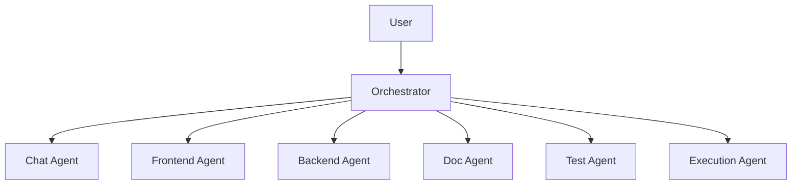
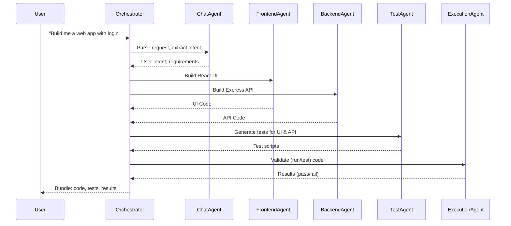
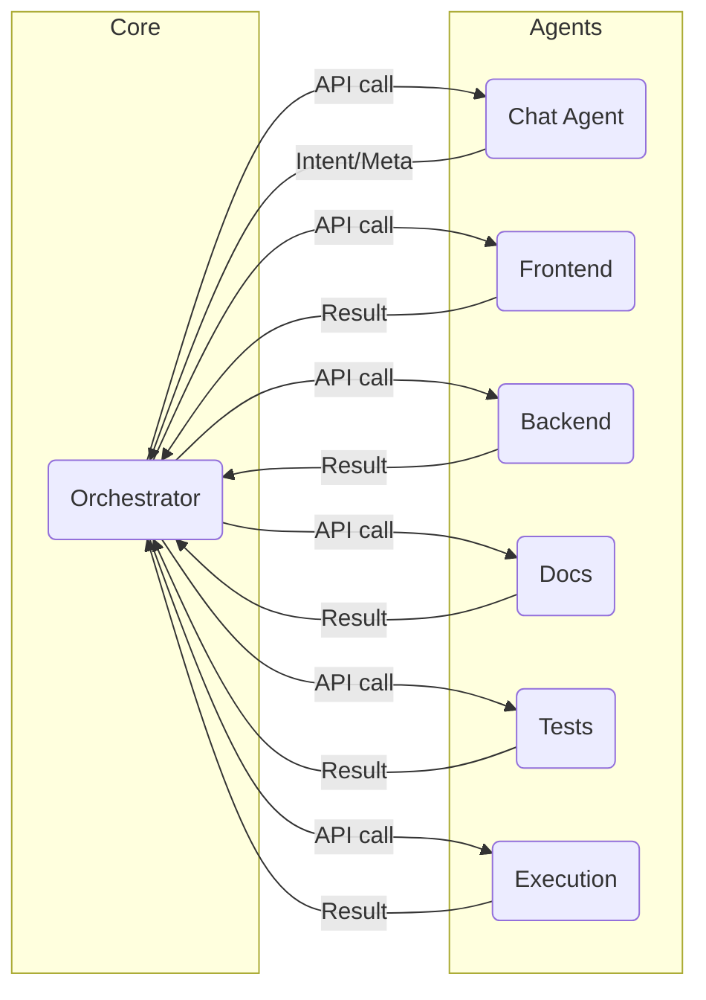

# Multi-Agent Coding AI Platform – Architecture & Flows

---

## 1. Component Diagram



**Explanation:**  
- The Orchestrator acts as the central brain, receiving user requests and distributing tasks to specialized agents.
- Each agent is an independently running microservice (API).

---

## 2. Sequence Diagram (Sample End-to-End Request)



---

## 3. Data Flow Diagram

```mermaid
flowchart LR
  U(User) -->|Request: "Build X"| O[Orchestrator]
  O -->|Parse & Decompose| CA(Chat Agent)
  CA -->|Intent| O
  O -->|Task: Frontend| FA(Frontend Agent)
  O -->|Task: Backend| BA(Backend Agent)
  O -->|Task: Docs| DA(Doc Agent)
  FA -->|Code| O
  BA -->|Code| O
  DA -->|Docs| O
  O -->|Testing Request| TA(Test Agent)
  TA -->|Test Results| O
  O -->|Execution Request| EA(Execution Agent)
  EA -->|Validation| O
  O -->|Project Package| U
```

**Explanation:**  
- User request travels to Orchestrator.
- Workflow is decomposed, delegated, aggregated through returning responses.

---

## 4. Agent Interaction Flow



---

## 5. Sample Interaction Table

| Step | Request        | Service         | Action                                | Output                          |
|------|---------------|-----------------|---------------------------------------|----------------------------------|
| 1    | User query    | Orchestrator    | Parses, orchestrates                  | Task plan                       |
| 2    | NLP intent    | Chat Agent      | Understands context & goals           | Intents, metadata               |
| 3    | UI code       | Frontend Agent  | Code generation (React, etc)          | UI source code                   |
| 4    | API code      | Backend Agent   | Code generation (Node, etc)           | API source code                  |
| 5    | Docs          | Doc Agent       | Generates documentation               | Markdown/docs                    |
| 6    | Testing       | Test Agent      | Creates unit/integration tests         | Test scripts/result              |
| 7    | Validation    | Execution Agent | Runs code/tests, validates            | Success/fail, logs               |
| 8    | Collation     | Orchestrator    | Bundles all outputs                   | Package: code, docs, tests, logs |

---

## 6. Expansion: Modular Agent Addition

- Plug-and-play: Add a new agent by running a new microservice and registering its endpoint w/ the orchestrator.
- Example: Add a “Deployment Agent” for deploying completed code to cloud.

---

## 7. Error/Health Flow

- Agents expose `/health` and `/ready` endpoints for checks.
- Orchestrator polls agents on startup and monitors status.

---

# Usage Guidance

- Use these diagrams in Excalidraw, diagrams.net, Mermaid Live Editor, or Obsidian for visual flow.
- Each diagram reflects one architectural concern (component, sequence, data, interaction).
- You can expand by drawing flows for agent discovery, streaming responses, error fallback, etc.

---
